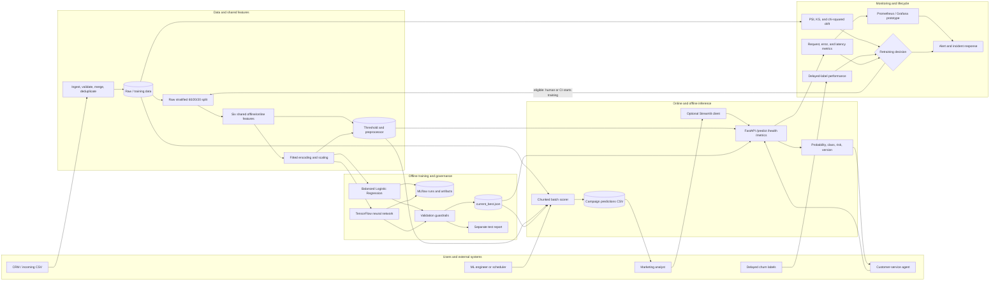

# Enterprise MLOps Churn Prediction System

> Verified mini-production ML prototype for telecommunications customer churn prediction

## Verified libraries and runtime

[](https://www.python.org/)
[](https://www.tensorflow.org/)
[](https://keras.io/)
[](https://scikit-learn.org/)
[](https://pandas.pydata.org/)
[](https://numpy.org/)
[](https://mlflow.org/)
[](https://fastapi.tiangolo.com/)
[](https://pytest.org/)
[](https://prometheus.io/)

Supporting packages are pinned in [`requirements.txt`](requirements.txt), including SciPy 1.11.2, Uvicorn 0.23.2, Pydantic 1.x, SHAP 0.42.1, LIME 0.2.0.1, Streamlit 1.27.0, Plotly 5.17.0, imbalanced-learn 0.11.0, and pytest-cov 4.1.0.

## Project status at a glance

- **Problem and data:** binary churn classification over 7,043 customers and 21 raw columns.
- **Leakage-safe split:** raw stratified 60/20/20 train/validation/test split before fitting transformations or data-derived features.
- **Shared features:** six engineered features are used by training, online serving, and batch scoring.
- **Train-only statistic:** the high-value-customer threshold is fitted only on training rows and persisted as `89.75`.
- **Baseline:** balanced Logistic Regression.
- **Candidate:** **TensorFlow 2.13** neural network `[64, 32, 16]`; it was not replaced with scikit-learn `MLPClassifier`.
- **Candidate safeguards:** balanced class weights, deterministic seed 42, dropout, early stopping, and learning-rate reduction.
- **Model governance:** validation metrics determine promotion; test metrics remain a separate final estimate.
- **Champion:** `baseline_v1.0.0`, because candidate validation AUC decreased by `0.0054`.
- **Inference:** verified FastAPI online scoring and chunked offline batch scoring share the fitted preprocessing artifacts and champion manifest.
- **Operations:** Prometheus-format API metrics, data-quality checks, PSI/KS/chi-squared drift checks, and four-signal retraining decision logic.
- **Verification:** 96/96 unit tests passed with 69% source coverage.
- **Submission:** six-page, exactly 1,500-word PDF with repository link, end-to-end architecture, and four execution-evidence panels.

Streamlit, SHAP/LIME, Docker, CI/CD, Prometheus UI, and Grafana are present as optional prototypes. They are not represented as fully deployed or end-to-end verified production services.

## Business problem and intended use

The positive class is `Churn = Yes`. The model supports two human-reviewed retention workflows:

1. A customer-service agent requests a real-time risk score during an interaction.
2. A marketing team scores the customer base offline for periodic campaign selection.

The output is decision support. The system does not autonomously apply offers or make adverse customer decisions.

### Dataset

| Item | Value |
|---|---|
| Source | Public IBM-style Telco Customer Churn dataset |
| Rows | 7,043 customers |
| Raw columns | 21 |
| Target | `Churn` (`Yes`/`No`) |
| Positive-class share | Approximately 26.5% |
| Split | Stratified 60% train / 20% validation / 20% test |
| Identifier handling | `customerID` retained for ingestion/output but excluded from model features |
| Temporal limitation | No event timestamp; chronological splitting is therefore not applicable |

## End-to-end architecture and user/system workflow



## Assignment alignment

The implementation was cross-verified against `GradedAssignment/Instructions.txt`, `GradedAssignment/Criteria.png`, and `GradedAssignment/Notes.txt`. The originally referenced `data-science-ml-labs/@notes.txt` does not exist; `GradedAssignment/Notes.txt` contains the applicable checklist and matching rubric.

| Rubric criterion | Implemented evidence | Alignment |
|---|---|---|
| Problem Understanding & Data | Business use case, target, inputs, 7,043-row dataset, intended online/batch use, leakage-safe 60/20/20 split | Core complete |
| Model Development & Correctness | Balanced baseline, TensorFlow candidate, fitted preprocessing, appropriate metrics, validation selection | Core complete |
| Production System Design | Verified FastAPI prediction and 7,043-row batch scoring paths using one champion manifest | Core complete |
| Evaluation & Production Considerations | Imbalance handling, latency/throughput, metrics, quality/drift checks, incident and retraining logic | Core complete |
| Documentation & Presentation | Six-page PDF, repository link, architecture, implementation/results and four evidence panels | Complete |

For the complete requirement-to-evidence audit, see [Assignment Alignment and Workflow](docs/assignment_alignment_and_workflow.md).

## Model development and measured results

### Engineered features

| Feature | Construction | Skew control |
|---|---|---|
| `avg_monthly_charge` | `TotalCharges / tenure` | Shared deterministic implementation |
| `service_adoption_score` | Count of six add-on services | Shared deterministic implementation |
| `tenure_category` | Fixed tenure bands | Fixed boundaries |
| `payment_risk_flag` | Electronic-check indicator | Fixed mapping |
| `contract_stability_score` | Month-to-month=1, one-year=2, two-year=3 | Fixed mapping |
| `high_value_customer` | `MonthlyCharges > training p75` | Persisted train-only threshold |

`src/features/engineering.py` and the fitted `artifacts/preprocessor.pkl` are shared by training, FastAPI, and batch scoring to reduce training-serving skew.

### Models and promotion guardrails

The baseline uses balanced Logistic Regression. The candidate uses TensorFlow/Keras with hidden layers `[64, 32, 16]`, dropout `0.3`, balanced class weights, deterministic seed `42`, early stopping, and learning-rate reduction.

Promotion requires:

- candidate validation AUC ≥ `0.80`;
- candidate validation recall ≥ `0.75`; and
- candidate validation AUC gain over the baseline ≥ `0.0`.

| Dataset / metric | Baseline | TensorFlow candidate |
|---|---:|---:|
| Validation accuracy | 0.7488 | 0.7353 |
| Validation precision | 0.5174 | 0.5009 |
| Validation recall | 0.7941 | 0.7674 |
| Validation F1 | 0.6266 | 0.6061 |
| Validation AUC | 0.8354 | 0.8300 |
| Final test recall | 0.7807 | 0.7914 |
| Final test AUC | 0.8429 | 0.8364 |

The candidate passes the absolute AUC and recall thresholds but fails the required non-negative AUC gain. `models/current_best.json` therefore selects `baseline_v1.0.0` and records the `-0.0054` validation-AUC difference.

## Execution verification

The existing project-local virtual environment was reused; no new neural-network framework or replacement environment was installed.

### Fresh test result

```bash
./venv/bin/python -m pytest tests/unit -q \
  --cov=src \
  --cov-report=term \
  --cov-report=xml
```

```text
96 passed
0 failed
69% source coverage
```

### FastAPI verification

```text
GET  /health   -> HTTP 200, model_loaded=true, baseline_v1.0.0
POST /predict  -> HTTP 200, probability=0.760917, Yes, High
GET  /metrics  -> HTTP 200, Prometheus metrics present
```

### MLflow verification

Experiment `churn-prediction` contains two finished runs:

```text
baseline_20260808_041203   FINISHED
candidate_20260808_041229  FINISHED
```

### Performance evidence

| Measurement | Result |
|---|---:|
| Sequential requests | 100/100 successful |
| Sequential average | 9.56 ms |
| Sequential p95 | 10.21 ms |
| Sequential p99 | 18.79 ms |
| Concurrent requests | 100/100 successful, concurrency 10 |
| Concurrent p95 | 89.01 ms |
| Concurrent throughput | 126.29 requests/second |
| Batch scoring | 7,043 rows in approximately 0.25 seconds |

These are localhost functional measurements, not a cloud-capacity guarantee.

## Reproducible runbook

Run from the project root. Reuse the verified environment when available.

```bash
source venv/bin/activate

python -m src.data.quality

python -m src.training.train --model baseline
python -m src.training.train --model candidate
python -m src.training.evaluate

uvicorn src.serving.api:app --host 127.0.0.1 --port 8000

python scripts/benchmark_latency.py \
  --url http://127.0.0.1:8000 \
  --requests 100 \
  --concurrency 10 \
  --output artifacts/benchmark_results.json

python -m src.serving.batch_predict \
  --input data/raw/telco_customer_churn.csv \
  --output artifacts/predictions/batch_predictions.csv \
  --chunk-size 1000

python -m src.monitoring.drift_detector
python -m src.retraining.trigger
```

`src.training.evaluate` intentionally returns a non-zero status when the candidate is rejected. For the current results, this is a correct guardrail decision, not a training failure.

### Start and test FastAPI

```bash
uvicorn src.serving.api:app --host 127.0.0.1 --port 8000

curl -X POST "http://127.0.0.1:8000/predict" \
  -H "Content-Type: application/json" \
  --data @sample_request.json
```

### Start MLflow UI

```bash
mlflow ui \
  --backend-store-uri sqlite:///mlflow.db \
  --host 127.0.0.1 \
  --port 5000
```

## Access URLs and evidence status

| Component | Local URL | Evidence status |
|---|---|---|
| FastAPI | `http://127.0.0.1:8000` | Executed and verified |
| Swagger documentation | `http://127.0.0.1:8000/docs` | Available while API runs |
| Health | `http://127.0.0.1:8000/health` | Verified |
| Prediction | `POST http://127.0.0.1:8000/predict` | Verified |
| API observability | `http://127.0.0.1:8000/metrics` | Verified |
| MLflow | `http://127.0.0.1:5000` | Backend/runs verified; UI starts on demand |
| Streamlit | `http://127.0.0.1:8501` | Prototype, not execution-verified |
| Prometheus | `http://127.0.0.1:9090` | Configured, not end-to-end verified |
| Grafana | `http://127.0.0.1:3000` | Dashboard JSON exists; provisioning not verified |

## Online and offline triggers

| Mode | Trigger | Implemented behavior | Automation boundary |
|---|---|---|---|
| Online inference | `POST /predict` | Shared feature calculation, fitted preprocessing, champion prediction, risk/version response, metrics update | Synchronous and verified |
| Offline batch scoring | `python -m src.serving.batch_predict ...` | Chunked scoring to campaign CSV | Executed; external scheduling not included |
| Offline ingestion | `python -m src.data.ingestion ...` | Validate, merge, deduplicate and log incoming CSV | Unit-tested; retain one end-to-end ingestion log |
| Offline monitoring | `python -m src.monitoring.drift_detector` | PSI, KS and chi-squared report | Executed on simulated baseline/current split |
| Retraining eligibility | `python -m src.retraining.trigger` | Check label count, AUC drop, drift and model age | Logs decision; does not start training |
| Actual retraining | Human or CI invokes train/evaluate | Train both versions, compare validation, update champion | Weekly cron is policy configuration only |

## Code responsibilities and interactions

| File/group | Responsibility | Main interaction |
|---|---|---|
| `src/data/ingestion.py` | Incoming CSV validation, merge, deduplication and audit log | Calls the quality checker and creates training data |
| `src/data/quality.py` | Schema, missingness, range, duplicate and consistency checks | Used standalone and by ingestion |
| `src/data/preprocessing.py` | Cleaning, raw split, fitted encoding/scaling and feature ordering | Shared by training, API and batch paths |
| `src/features/engineering.py` | Six shared business features and persisted percentile threshold | Offline fit; online reuse |
| `src/models/baseline.py` | Balanced Logistic Regression | Trained offline; loaded when champion |
| `src/models/candidate.py` | TensorFlow neural network | Trained offline; loaded only if promoted |
| `src/models/explainer.py` | Optional SHAP/LIME adapter | Used by optional `/explain` endpoint |
| `src/training/train.py` | Split, feature/preprocessing fit, train, evaluate, save, MLflow log | Coordinates model-development pipeline |
| `src/training/evaluate.py` | Validation comparison and promotion guardrails | Writes reports and `current_best.json` |
| `src/serving/api.py` | Online API, validation, champion loading and metrics | Loads shared artifacts and selected model |
| `src/serving/batch_predict.py` | Chunked offline scoring | Uses the same artifacts and champion as API |
| `src/monitoring/drift_detector.py` | PSI, KS and chi-squared drift checks | Produces JSON drift evidence |
| `src/retraining/trigger.py` | Four-signal retraining eligibility | Produces decision logs; no auto-training |
| `scripts/benchmark_latency.py` | Sequential/concurrent API load test | Produces benchmark JSON |
| `scripts/build_submission_pdf.py` | Reproducible six-page report generation | Reads retained evidence artifacts |
| `tests/unit/*.py` | 96 unit tests over core components | Produces coverage evidence |

## Project structure

```text
enterprise-mlops-churn-prediction/
├── config/                    # Model, serving, monitoring and feature policy
├── data/raw/                  # Source dataset
├── src/
│   ├── data/                  # Ingestion, quality and preprocessing
│   ├── features/              # Shared feature engineering
│   ├── models/                # Baseline, TensorFlow candidate and explainer
│   ├── training/              # Training, comparison and promotion
│   ├── serving/               # FastAPI and batch inference
│   ├── monitoring/            # Drift detection
│   └── retraining/            # Eligibility logic
├── tests/unit/                # 96 verified tests
├── artifacts/                 # Reports, logs, benchmarks and predictions
├── models/                    # Saved models and champion manifest
├── mlruns/ and mlflow.db      # Experiment tracking evidence
├── monitoring/                # Prometheus/Grafana prototype configs
├── docker/                    # Optional container prototype
├── webapp/                    # Optional Streamlit prototype
├── scripts/                   # Benchmark and PDF builder
├── docs/                      # Design, architecture and alignment audit
└── output/pdf/                # Consolidated submission
```

## Optional deployment prototypes

### Docker Compose

```bash
docker compose -f docker/docker-compose.yml up --build
```

The current Compose file defines API, MLflow, Prometheus, and Grafana. It does not define Streamlit. Prometheus alert-rule mounting and Grafana datasource/dashboard provisioning require completion before the stack is described as operational.

### Streamlit

```bash
streamlit run webapp/app.py \
  --server.address 127.0.0.1 \
  --server.port 8501
```

## Necessary improvements

1. Retain one real `ingestion_*.json` proof from a representative incoming batch.
2. Add Prometheus alert-rule mounting and Grafana datasource/dashboard provisioning.
3. Align Compose and documentation if Streamlit should be part of the container stack.
4. Repair optional CI artifact passing, nonexistent integration-test references, and handling of a valid “keep baseline” outcome.
5. Automate delayed-label AUC/recall and campaign-ROI collection.
6. Replace arbitrary integer mappings for nominal features with a fitted one-hot or another unknown-safe encoder.
7. Add external scheduling only if automated retraining is required.

## Documentation and retained evidence

- [Final submission PDF](output/pdf/enterprise_mlops_churn_submission.pdf)
- [Assignment alignment and workflow](docs/assignment_alignment_and_workflow.md)
- [Design document](docs/design_document.md)
- [Architecture diagram](docs/architecture_diagram.svg)
- `artifacts/eval/`: validation/test metrics and promotion decision
- `artifacts/benchmark_results.json`: latency and throughput
- `artifacts/predictions/batch_predictions.csv`: complete batch output
- `artifacts/drift_reports/`: executed drift evidence
- `artifacts/logs/`: quality and retraining-decision logs
- `models/current_best.json`: champion and guardrail reason
- `mlflow.db` and `mlruns/`: two finished tracked runs
- `coverage.xml` and `artifacts/test_summary.json`: test evidence

## Academic-use note

This is an academic mini-production prototype for the BITS Pilani MSc program. It is not represented as a fully deployed cloud production system.

**Last updated:** August 2026
**Version:** 2.0.0
**Status:** Core assignment verified; optional production extensions remain prototypes
