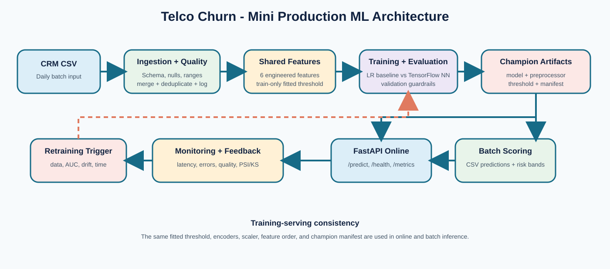
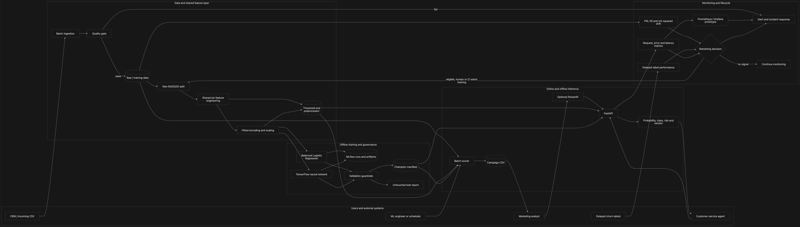

# Enterprise MLOps Churn Prediction System

> A reproducible mini-production machine-learning system for telecommunications customer-churn prediction, covering governed data ingestion, leakage-safe feature engineering, TensorFlow candidate training, champion selection, online and batch serving, Docker deployment, observability, drift detection, and retraining decisions.

[](https://www.python.org/)
[](https://www.tensorflow.org/)
[](https://scikit-learn.org/)
[](https://mlflow.org/)
[](https://fastapi.tiangolo.com/)
[](https://www.docker.com/)
[](https://prometheus.io/)
[](https://grafana.com/)
[](artifacts/test_summary.json)

## Executive overview

The system predicts whether a customer is likely to churn (`Churn = Yes`) and supports two human-reviewed retention workflows:

1. **Online decision support:** a customer-service application requests a low-latency prediction from FastAPI.
2. **Offline campaign planning:** a marketing workflow scores a customer CSV in chunks and writes probability, class, risk band, and model version.

The implementation deliberately extends beyond a training notebook. It preserves the artifacts required to reproduce and serve the selected model, validates incoming data, keeps training and inference transformations consistent, compares a simple baseline with a TensorFlow neural network under explicit promotion rules, exposes system metrics, provisions Prometheus and Grafana, detects feature drift, and records why retraining should or should not occur.

The current champion is **`baseline_v1.0.0`**. The TensorFlow candidate met the absolute validation AUC and recall thresholds, but its validation AUC was `0.0054` below the baseline. Retaining the simpler model is therefore the intended governed outcome—not a failed training run.

### Current implementation state

| Capability | State | Retained evidence or implementation |
|---|---|---|
| Source dataset identity, provenance, checksum, and rights | **Implemented** | [`docs/dataset_provenance_and_license.md`](docs/dataset_provenance_and_license.md) |
| Batch ingestion, validation, merge, and deduplication | **Implemented and executed** | [`src/data/ingestion.py`](src/data/ingestion.py), [`artifacts/logs/ingestion_20260808_082509.json`](artifacts/logs/ingestion_20260808_082509.json) |
| Leakage-safe split and fitted preprocessing | **Implemented and persisted** | [`src/data/preprocessing.py`](src/data/preprocessing.py), [`artifacts/preprocessor.pkl`](artifacts/preprocessor.pkl) |
| Offline/online feature consistency | **Implemented, persisted, and parity-tested** | Shared 25-column vector verified across independently loaded API/batch paths; a missing fitted threshold fails closed instead of using a fallback |
| Baseline and TensorFlow candidate training | **Implemented and executed** | [`models/baseline/logistic_regression_v1.pkl`](models/baseline/logistic_regression_v1.pkl), [`models/candidate/neural_network_v1.h5`](models/candidate/neural_network_v1.h5) |
| Evaluation and governed champion selection | **Implemented and executed** | [`artifacts/eval/model_comparison.md`](artifacts/eval/model_comparison.md), [`models/current_best.json`](models/current_best.json) |
| Fresh-clone API startup from saved artifacts | **Implemented and integration-tested** | Real saved-artifact startup tests in [`tests/integration/test_saved_artifact_api.py`](tests/integration/test_saved_artifact_api.py) |
| Online REST and offline batch inference | **Implemented and executed** | [`src/serving/api.py`](src/serving/api.py), [`src/serving/batch_predict.py`](src/serving/batch_predict.py) |
| Docker API runtime boundary and health checks | **Implemented and clean-built locally** | [`docker/Dockerfile.api`](docker/Dockerfile.api), [`docker/requirements.api.txt`](docker/requirements.api.txt) |
| Prometheus rules and Grafana provisioning | **Implemented and verified end to end** | [`artifacts/monitoring/stack_verification.json`](artifacts/monitoring/stack_verification.json) |
| Alert notification delivery | **Internal verified; external ready for credentials** | [`notification_routing_verification.json`](artifacts/monitoring/notification_routing_verification.json) records live internal delivery; the secure template fans warning/critical alerts out to webhook, Slack, and email without committing secrets |
| Drift detection and retraining eligibility | **Implemented and locally exercised** | [`src/monitoring/drift_detector.py`](src/monitoring/drift_detector.py), [`src/retraining/trigger.py`](src/retraining/trigger.py) |
| Automated regression evidence | **117/117 passed** | 100 unit + 17 integration tests and 69% source coverage in [`artifacts/test_summary.json`](artifacts/test_summary.json) |
| Rubric-ordered Word submission | **Complete and visually verified** | Six pages and 1,929 words in [`docs/Enterprise_MLOps_Churn_Level4_Analytical_Summary.docx`](docs/Enterprise_MLOps_Churn_Level4_Analytical_Summary.docx) |
| GitHub Actions lifecycle workflow | **Implemented; hosted run pending** | [`.github/workflows/enterprise-mlops-churn-ci.yml`](../../.github/workflows/enterprise-mlops-churn-ci.yml) |
| Automated production deployment or retraining | **Outside current scope** | CI validates readiness; a human or CI invocation starts training and no external environment is mutated automatically |

### Verified release snapshot

| Dimension | Verified result | Primary proof |
|---|---|---|
| Data | 7,043 customers, 21 raw columns, 26.5% churn rate | [`data/raw/telco_customer_churn.csv`](data/raw/telco_customer_churn.csv) and [provenance record](docs/dataset_provenance_and_license.md) |
| Features | Six engineered features; training-only p75 threshold `89.75`; final vector has 25 columns | [`config/feature_config.yaml`](config/feature_config.yaml), [`artifacts/feature_threshold.json`](artifacts/feature_threshold.json) |
| Champion | `baseline_v1.0.0`; candidate validation AUC was `0.0054` lower | [`models/current_best.json`](models/current_best.json), [`artifacts/eval/model_comparison.md`](artifacts/eval/model_comparison.md) |
| Serving | FastAPI and chunked batch inference use the same saved bundle | [`src/serving/api.py`](src/serving/api.py), [`src/serving/batch_predict.py`](src/serving/batch_predict.py) |
| Performance | 9.56 ms average, 10.21 ms sequential p95, 126.29 requests/second concurrent throughput | [`artifacts/benchmark_results.json`](artifacts/benchmark_results.json) |
| Monitoring | Prometheus/Grafana provisioned; internal Alertmanager delivery verified | [`stack_verification.json`](artifacts/monitoring/stack_verification.json), [`notification_routing_verification.json`](artifacts/monitoring/notification_routing_verification.json) |
| Regression gate | 100 unit + 17 integration = **117/117 passed**; 69% coverage | [`artifacts/test_summary.json`](artifacts/test_summary.json) |

## End-to-end architecture and user/system workflow

### Mini-production architecture summary



This restored architecture view emphasizes training-serving consistency and the governed feedback path. The implementation around it includes:

- **Data Sources:** the identified IBM teaching dataset represents a CRM/customer snapshot; future labeled batches can enter through the same ingestion interface.
- **Pipelines:** incoming CSV data is schema-checked, quality-checked, merged, deduplicated by `customerID`, and logged before it can become training input.
- **Features:** one shared feature module and one persisted preprocessing object are reused across training, API serving, and batch scoring.
- **Training:** a balanced Logistic Regression baseline is evaluated against a TensorFlow/Keras neural network.
- **Model Registry (optional):** MLflow retains run metadata and artifacts; the Git-tracked champion manifest is the deterministic serving contract. A remote registry is not required for this prototype.
- **Serving:** FastAPI handles synchronous requests; the batch scorer handles file-oriented campaign inference. Both load the same champion bundle.
- **Monitoring:** API counters and latency histograms are scraped by Prometheus; Grafana visualizes operational signals; separate statistical checks detect data drift.
- **Retraining:** new labeled volume, AUC degradation, feature drift, and model age produce an eligibility decision. Retraining and promotion remain governed actions.

### Detailed user and system workflow



The detailed workflow shows how internal and external actors interact with the implemented system. CRM batches pass through ingestion and quality controls; shared feature and preprocessing artifacts feed governed training as well as online and batch inference; customer-service agents and marketing analysts consume predictions; and delayed labels, operational metrics, and drift signals close the monitoring and retraining-decision loop.

## Complete ML lifecycle

### 1. Business objective and decision boundary

The positive class is customer churn. A prediction response contains:

- churn probability in `[0, 1]`;
- binary prediction (`Yes` or `No`) using a `0.5` decision threshold;
- risk band (`Low < 0.4`, `Medium 0.4–0.7`, `High ≥ 0.7`);
- champion model version;
- request latency and timestamp.

Predictions are **decision support**, not autonomous decisions. Retention offers or other customer actions require human or downstream business approval. `customerID` is retained only for ingestion, deduplication, and output association; it is excluded from model features.

### 2. Dataset provenance, integrity, and licensing

| Property | Recorded value |
|---|---|
| Dataset | IBM Telco Customer Churn teaching sample |
| Original filename | `WA_Fn-UseC_-Telco-Customer-Churn.csv` |
| Repository path | [`data/raw/telco_customer_churn.csv`](data/raw/telco_customer_churn.csv) |
| Shape | 7,043 rows × 21 raw columns, including `Churn` |
| Positive-class share | Approximately 26.5% |
| Evaluated-file SHA-256 | `88be4b93fbe0cc83421af1c503794c97c342eca914c1576db7c276e61d61358a` |
| Source lineage | IBM sample context → IBM archived code pattern → Kaggle catalogue record → checksum-identified project copy |
| Rights statement | Kaggle records “Data files © Original Authors”; no standard open-data license is asserted |
| Temporal limitation | The sample has no event timestamp, so chronological splitting and point-in-time joins cannot be demonstrated |

The Apache-2.0 license on IBM's archived **code pattern** does not automatically license the CSV. This repository does not relicense the data. Academic reproducibility does not remove the obligation to review the current source terms before redistribution or non-academic use. The complete acquisition limitation, access date, rights interpretation, and integrity procedure are recorded in [`docs/dataset_provenance_and_license.md`](docs/dataset_provenance_and_license.md).

Verify the evaluated bytes with:

```bash
shasum -a 256 data/raw/telco_customer_churn.csv
```

### 3. Batch ingestion and retained audit evidence

[`src/data/ingestion.py`](src/data/ingestion.py) implements a file-based production ingestion boundary:

1. read the incoming CSV;
2. apply schema, missingness, range, duplicate, and consistency checks;
3. abort before writing if blocking checks fail;
4. load an existing training file when present;
5. append the new batch and retain the last row by ingestion order for duplicate `customerID` values;
6. write the merged training data; and
7. persist a timestamped JSON audit summary.

Existing rows are ordered before incoming rows, so an incoming row replaces an
existing row with the same `customerID`. Within a single file, the last
occurrence wins. Because the source has no event/update timestamp, this policy
does not claim event-time recency; a future timestamp contract would be needed
for that guarantee.

The representative replay in [`artifacts/logs/ingestion_20260808_082509.json`](artifacts/logs/ingestion_20260808_082509.json) is Git-retained evidence of the complete path:

| Ingestion result | Value |
|---|---:|
| Status | `success` |
| Input rows | 7,043 |
| Existing rows | 0 |
| Output rows | 7,043 |
| Duplicate customer IDs removed | 0 |
| Schema check | Passed |
| Missing-value check | Passed; total missing rate `0.0` |
| Range check | Passed |
| Duplicate-row check | Passed |
| Overall quality decision | Passed |

The source contains 59 historical `TotalCharges` values that differ from `tenure × MonthlyCharges` by more than 20%. This is retained as a **non-blocking consistency warning**, because historical accumulated charges can legitimately differ from the current monthly charge multiplied by tenure.

Reproduce the ingestion path without modifying the raw source:

```bash
python -m src.data.ingestion \
  --input data/raw/telco_customer_churn.csv \
  --output data/training/representative_ingestion_v1.csv
```

### 4. Leakage-safe splitting, features, and preprocessing

The raw dataset is split first with a fixed random seed and target stratification:

| Split | Share | Purpose |
|---|---:|---|
| Training | 60% | Fit feature statistics, encoders, scaler, and model parameters |
| Validation | 20% | Compare baseline and candidate and decide promotion |
| Test | 20% | Produce a final estimate after the selection policy is defined |

This ordering prevents the validation and test rows from influencing the fitted high-value threshold, encoders, or scaler.

Six business features are defined once in [`src/features/engineering.py`](src/features/engineering.py):

| Engineered feature | Definition | Consistency control |
|---|---|---|
| `avg_monthly_charge` | `TotalCharges / tenure`; current monthly charge is used when tenure is zero | Same deterministic function offline and online |
| `service_adoption_score` | Count of six subscribed add-on services | Same fixed service list |
| `tenure_category` | Fixed bins: 0–12, 13–24, 25–48, and 48+ months | Same bin boundaries |
| `payment_risk_flag` | `1` for electronic check, otherwise `0` | Same exact mapping |
| `contract_stability_score` | Month-to-month=`1`, one-year=`2`, two-year=`3` | Same exact mapping |
| `high_value_customer` | `MonthlyCharges` above the training-set 75th percentile | Fitted value `89.75` persisted in [`artifacts/feature_threshold.json`](artifacts/feature_threshold.json) |

Categorical encoders, the numerical scaler, and the final feature order are fitted only on training rows and saved together in [`artifacts/preprocessor.pkl`](artifacts/preprocessor.pkl). Training, FastAPI, batch inference, and saved-artifact integration tests all load this same object. This is the project’s lightweight alternative to a full feature store and prevents duplicated training-serving transformation logic.

The retained model contract uses one fitted `LabelEncoder` integer column per
categorical input; it does **not** one-hot encode production features. At
serving time, an unseen multi-class value maps to that encoder's first known
class, while unseen values in the binary columns remain strict and raise a
validation error. This compatibility policy is explicit but intentionally
conservative. Migrating to one-hot encoding or a dedicated unknown sentinel
would change the 25-column feature contract and therefore requires retraining,
re-evaluation, artifact replacement, and renewed API/batch parity evidence.

### 5. Training and experiment tracking

[`src/training/train.py`](src/training/train.py) coordinates load → raw split → feature creation → preprocessing → training → validation/test evaluation → persistence → MLflow logging.

| Model | Implementation | Production-relevant controls | Saved artifact |
|---|---|---|---|
| Baseline | Balanced scikit-learn Logistic Regression | `class_weight="balanced"`, seed 42, simple and interpretable decision boundary | [`models/baseline/logistic_regression_v1.pkl`](models/baseline/logistic_regression_v1.pkl) |
| Candidate | TensorFlow/Keras ANN with hidden layers `[64, 32, 16]` | Balanced class weights, seed 42, dropout `0.3`, early stopping, and learning-rate reduction | [`models/candidate/neural_network_v1.h5`](models/candidate/neural_network_v1.h5) |

TensorFlow 2.13 is used for the neural-network candidate; the candidate was not substituted with scikit-learn `MLPClassifier`. The local MLflow backend records two finished runs and their parameters, metrics, preprocessing artifacts, and model artifacts. For this mini-system, [`models/current_best.json`](models/current_best.json) provides the small, explicit registry-to-serving contract.

### 6. Evaluation, promotion, and champion governance

Promotion uses validation metrics only. Test metrics are retained separately so that model selection does not optimize against the final test estimate.

Promotion requires all of the following:

- candidate validation AUC ≥ `0.80`;
- candidate validation recall ≥ `0.75`; and
- candidate validation AUC gain over the baseline ≥ `0.0`.

| Dataset / metric | Baseline | TensorFlow candidate | Difference (candidate − baseline) |
|---|---:|---:|---:|
| Validation accuracy | 0.7488 | 0.7353 | -0.0135 |
| Validation precision | 0.5174 | 0.5009 | -0.0165 |
| Validation recall | 0.7941 | 0.7674 | -0.0267 |
| Validation F1 | 0.6266 | 0.6061 | -0.0205 |
| **Validation AUC** | **0.8354** | **0.8300** | **-0.0054** |
| Final test recall | 0.7807 | 0.7914 | +0.0107 |
| Final test AUC | 0.8429 | 0.8364 | -0.0065 |

The candidate passes the absolute AUC and recall floors but does not improve validation AUC. The governed decision is therefore **KEEP BASELINE**, recorded consistently in:

- [`artifacts/eval/baseline_evaluation.json`](artifacts/eval/baseline_evaluation.json);
- [`artifacts/eval/candidate_evaluation.json`](artifacts/eval/candidate_evaluation.json);
- [`artifacts/eval/model_comparison.json`](artifacts/eval/model_comparison.json);
- [`artifacts/eval/model_comparison.md`](artifacts/eval/model_comparison.md); and
- [`models/current_best.json`](models/current_best.json).

The evaluation command intentionally returns a distinct non-zero outcome when the candidate is rejected. The CI workflow now validates that `KEEP BASELINE` is a legitimate governed result and continues with the selected baseline rather than treating it as an unexpected failure.

### 7. Serving: online and batch inference

#### Online FastAPI service

At startup, [`src/serving/api.py`](src/serving/api.py) loads the champion manifest, selected model, persisted preprocessor, persisted feature threshold, and optional explainer. The core endpoints are:

| Endpoint | Responsibility |
|---|---|
| `GET /` | Service metadata and endpoint discovery |
| `GET /health` | Readiness, model-loaded state, and champion version |
| `POST /predict` | Input validation, shared feature transformation, champion inference, risk band, latency, and version |
| `GET /metrics` | Prometheus-format request, prediction, error, and latency metrics |
| `POST /explain` | Optional explanation path when an explainer is available |

The Pydantic contract validates required fields and numerical ranges before inference. A retained verification request produced HTTP `200`, probability `0.760917`, prediction `Yes`, risk `High`, and model version `baseline_v1.0.0`.

#### Offline batch scorer

[`src/serving/batch_predict.py`](src/serving/batch_predict.py) loads the same champion bundle and scores CSV data in configurable chunks. It preserves `customerID` for business association and writes churn probability, prediction, risk band, model version, and scoring timestamp. This provides high-throughput campaign scoring without creating a separate transformation path.

### 8. Dockerized runtime and fresh-clone readiness

The previously missing runtime bundle is now Git-retained. A fresh clone contains:

- the baseline model;
- the TensorFlow candidate model and metadata;
- the fitted preprocessor;
- the fitted feature threshold;
- validation and test evaluation reports;
- the comparison and champion decision;
- the representative ingestion log; and
- monitoring verification evidence.

[`docker/Dockerfile.api`](docker/Dockerfile.api) copies these artifacts into the image. [`docker/requirements.api.txt`](docker/requirements.api.txt) defines a TensorFlow-only serving boundary and deliberately excludes training-only or optional packages such as MLflow, Streamlit, SHAP, and LIME. The container exposes port `8000` and includes an API health check.

From a fresh clone, start the locally verified API and observability path:

```bash
cd projects/enterprise-mlops-churn-prediction
docker compose -f docker/docker-compose.yml up --build api prometheus grafana
```

Then verify the complete path in another terminal:

```bash
python scripts/verify_monitoring_stack.py
```

The default Grafana password `change-me-local` is only a local-development fallback. Set `GRAFANA_ADMIN_USER` and `GRAFANA_ADMIN_PASSWORD` before starting Compose for any shared environment.

### 9. Monitoring, alerting, and Grafana provisioning

The Docker Compose monitoring path is fully wired:

```text
FastAPI /metrics
      ↓ scrape every 10 seconds
Prometheus + mounted alerts.yml
      ├── firing/resolved → Alertmanager → internal JSONL audit receiver
      │                                  └→ external webhook + Slack + email
      │                                     (credential-enabled warning/critical route)
      └── metrics datasource → Grafana dashboard UID: churn-model-performance
```

Prometheus mounts both [`monitoring/prometheus.yml`](monitoring/prometheus.yml) and [`monitoring/alerts.yml`](monitoring/alerts.yml). The alert rules are:

| Alert | Signal | Current threshold |
|---|---|---|
| `APIDown` | API target availability | `up{job="churn-prediction-api"} == 0` for 1 minute |
| `HighErrorRate` | Error/request ratio | Above 5% for 5 minutes |
| `HighLatency` | Prediction p95 latency | Above 0.2 seconds for 5 minutes |
| `LowThroughput` | Prediction rate | Below 1 prediction/second for 10 minutes |

Grafana provisioning is version-controlled and mounted read-only:

- [`monitoring/grafana/provisioning/datasources/prometheus.yml`](monitoring/grafana/provisioning/datasources/prometheus.yml) creates the default Prometheus datasource at `http://prometheus:9090` with stable UID `prometheus`;
- [`monitoring/grafana/provisioning/dashboards/churn.yml`](monitoring/grafana/provisioning/dashboards/churn.yml) loads dashboards from `/var/lib/grafana/dashboards`; and
- [`monitoring/grafana/dashboards/model_performance.json`](monitoring/grafana/dashboards/model_performance.json) defines throughput, latency, error-rate, and total-prediction panels.

[`scripts/verify_monitoring_stack.py`](scripts/verify_monitoring_stack.py) performs a real health request and prediction, waits for Prometheus to report the API target as `up`, verifies scraped prediction metrics and all four rules, and queries Grafana for the provisioned datasource and dashboard. The retained [`artifacts/monitoring/stack_verification.json`](artifacts/monitoring/stack_verification.json) records a successful verification with:

- API health HTTP `200` and loaded `baseline_v1.0.0`;
- real prediction HTTP `200`;
- Prometheus ready HTTP `200`;
- API target health `up`;
- all four expected rules loaded; and
- Grafana health, datasource, and dashboard API checks returning HTTP `200`.

Alertmanager is mounted and registered in Prometheus. Its default receiver posts both firing and resolved notifications to the network-internal [`monitoring/notification_sink.py`](monitoring/notification_sink.py), which persists append-only JSONL audit records in the `notification-data` volume. This path requires no external credentials and is not published outside the Compose network.

For simultaneous internal and external delivery, copy [`monitoring/alertmanager/alertmanager.external.example.yml`](monitoring/alertmanager/alertmanager.external.example.yml) to the Git-ignored `monitoring/alertmanager/alertmanager.local.yml`, replace the SMTP deployment values, and create the untracked files `external_webhook_url`, `slack_webhook_url`, and `smtp_password` under `monitoring/alertmanager/secrets/`. Then start the stack with:

```bash
ALERTMANAGER_CONFIG_FILE=../monitoring/alertmanager/alertmanager.local.yml \
  docker compose -f docker/docker-compose.yml up -d
```

The external template uses file-backed credentials. All severities remain in the internal audit receiver, while warning and critical alerts also fan out to a generic webhook, Slack, and email. Actual external delivery remains environment-specific until valid approved endpoints and credentials are supplied and tested; no secret or live destination is committed. The retained [`notification_routing_verification.json`](artifacts/monitoring/notification_routing_verification.json) records the successful internal smoke delivery and explicitly marks external delivery as unverified.

### 10. Data drift and model-health monitoring

Operational health alone cannot prove that model behavior remains valid. [`src/monitoring/drift_detector.py`](src/monitoring/drift_detector.py) therefore provides feature-level statistical monitoring:

| Feature type | Checks | Interpretation |
|---|---|---|
| Continuous | Population Stability Index and Kolmogorov–Smirnov test | PSI above `0.2` or KS p-value below `0.05` indicates material distribution change |
| Categorical | Chi-squared test | p-value below `0.05` indicates changed category distribution |

The local exercise checks `tenure`, `MonthlyCharges`, `TotalCharges`, `Contract`, `PaymentMethod`, and `InternetService`. In real operation, the baseline window should be the approved training distribution and the current window should contain recent production observations. Delayed labels are required to calculate current AUC, recall, and business effectiveness; input drift is an early-warning signal, not a substitute for performance monitoring.

### 11. Retraining decision and lifecycle closure

[`src/retraining/trigger.py`](src/retraining/trigger.py) evaluates four independent signals:

| Signal | Configured trigger |
|---|---|
| New labeled data | At least 1,000 new labeled rows |
| Performance degradation | AUC drop greater than `0.05` from the approved baseline |
| Feature drift | Maximum drift score greater than `0.3` |
| Model age | At least 30 days since training |

The output includes every evaluated signal, threshold, observed value, triggered state, and primary reason. It answers **whether retraining is eligible**; it does not automatically train, promote, or deploy a new model. That separation prevents a transient drift signal or bad batch from silently replacing the champion.

When retraining is approved, the lifecycle returns to the raw split and training pipeline, produces a challenger, compares it on validation data, writes a new champion manifest only according to guardrails, runs real saved-artifact tests, and resumes monitoring.

## End-to-end lineage and reproducibility

The project’s lineage is explicit and inspectable without a proprietary metadata platform:

| Lineage stage | Input | Transformation or decision | Persisted output | Downstream consumer |
|---|---|---|---|---|
| Source identity | IBM teaching sample | Checksum and rights recording | Dataset provenance record + raw CSV | Ingestion and training |
| Ingestion | Incoming CSV | Quality gate, merge, deduplicate | Timestamped ingestion JSON + training CSV | Training pipeline |
| Split | Raw labeled rows | Seeded stratified 60/20/20 split | In-memory train/validation/test partitions | Feature/preprocessing fit |
| Feature fit | Training rows | Six feature definitions; p75 fit | `feature_threshold.json` | Validation, test, API, batch |
| Preprocessing fit | Training features | Cleaning, encoding, scaling, feature ordering | `preprocessor.pkl` | Both models and both serving modes |
| Training | Processed training rows | Baseline and TensorFlow optimization | `.pkl`, `.h5`, metadata, MLflow runs | Evaluation |
| Evaluation | Validation and untouched test metrics | Absolute gates + baseline comparison | Evaluation JSON/Markdown | Champion selection and CI |
| Champion | Governed comparison | Promote candidate or keep baseline | `current_best.json` | API, batch, integration tests |
| Serving | Raw request or CSV | Shared feature/preprocessing path + champion inference | Response or prediction CSV | Retention workflow and monitoring |
| Monitoring | API metrics and current feature windows | Alerts, dashboard queries, PSI/KS/chi-square | Stack verification and drift reports | Operations and retraining trigger |
| Retraining decision | Labeled volume, AUC, drift, model age | Four-signal policy | Decision log | Human or CI training initiation |

Reproducibility controls include a fixed seed (`42`), pinned runtime versions, raw-data checksum, train-only fitting, saved preprocessing state, saved model versions, MLflow run history, machine-readable evaluation reports, an explicit champion manifest, a dedicated Docker serving dependency set, and executable tests around the real serving bundle.

## CI validation flow

The root workflow [`.github/workflows/enterprise-mlops-churn-ci.yml`](../../.github/workflows/enterprise-mlops-churn-ci.yml) is scoped to this project and implements:

```text
Data quality
    ↓
100 unit tests + coverage
    ↓
Train baseline and TensorFlow candidate
    ↓
Apply promotion guardrails
    ├── PROMOTE CANDIDATE ─┐
    └── KEEP BASELINE ─────┤ both are governed outcomes
                           ↓
17 integration tests: 5 saved-artifact serving + 12 dependency/documentation/notification contracts
    ↓
Docker build and API smoke test
    ↓
Release-readiness summary (no external deployment)
```

The workflow uploads quality, coverage, training, serving, and evaluation artifacts between jobs. It verifies that the comparison decision, process exit status, champion type, and selected model path agree. It runs all 17 existing integration tests rather than referencing a missing placeholder suite.

**Verification boundary:** all tests and Docker/monitoring checks described below were executed locally. A successful GitHub-hosted Actions run URL has not yet been retained, so hosted CI execution must not be represented as verified. The Linux CI dependency installation must also succeed with the TensorFlow 2.13 compatibility constraints before release readiness is claimed.

## Verification evidence

### Tests

[`artifacts/test_summary.json`](artifacts/test_summary.json) records:

| Test group | Passed | Failed |
|---|---:|---:|
| Unit | 100 | 0 |
| Saved-artifact serving integration | 5 | 0 |
| Dependency, documentation, and notification contracts | 12 | 0 |
| **Total** | **117** | **0** |

Source coverage is **69%**. Five of the 17 integration tests exercise the retained serving bundle and verify:

1. every champion-serving artifact exists;
2. `/health` reports the loaded champion;
3. `/predict` executes with the real preprocessor and champion model; and
4. `/metrics` exposes prediction observability; and
5. offline batch and online API preprocessing produce an identical final vector.

Run the same checks:

```bash
python -m pytest tests/unit -q --cov=src --cov-report=term --cov-report=xml
python -m pytest tests/integration -q
```

### Measured local performance

| Measurement | Result |
|---|---:|
| Sequential requests | 100/100 successful |
| Sequential average | 9.56 ms |
| Sequential p95 | 10.21 ms |
| Sequential p99 | 18.79 ms |
| Concurrent requests | 100/100 successful at concurrency 10 |
| Concurrent p95 | 89.01 ms |
| Concurrent throughput | 126.29 requests/second |
| Batch scoring | 7,043 rows in approximately 0.25 seconds |

These are local functional measurements retained in [`artifacts/benchmark_results.json`](artifacts/benchmark_results.json), not a cloud capacity or service-level guarantee.

## Reproducible runbook

Run commands from the project root.

### Start the saved champion immediately

```bash
source venv/bin/activate
uvicorn src.serving.api:app --host 127.0.0.1 --port 8000
```

Test it:

```bash
curl --fail http://127.0.0.1:8000/health

curl --fail -X POST http://127.0.0.1:8000/predict \
  -H "Content-Type: application/json" \
  --data @sample_request.json
```

### Rebuild the full training bundle

```bash
python -m src.data.quality
python -m src.training.train --model baseline
python -m src.training.train --model candidate
python -m src.training.evaluate
```

For the retained metrics, evaluation selects the baseline. A candidate-rejection exit outcome is expected and should be interpreted together with the generated comparison and champion files.

### Run batch scoring

```bash
python -m src.serving.batch_predict \
  --input data/raw/telco_customer_churn.csv \
  --output artifacts/predictions/batch_predictions.csv \
  --chunk-size 1000
```

### Benchmark the API

```bash
python scripts/benchmark_latency.py \
  --url http://127.0.0.1:8000 \
  --requests 100 \
  --concurrency 10 \
  --output artifacts/benchmark_results.json
```

### Run drift and retraining checks

```bash
python -m src.monitoring.drift_detector
python -m src.retraining.trigger
```

### Start MLflow

```bash
mlflow ui \
  --backend-store-uri sqlite:///mlflow.db \
  --host 127.0.0.1 \
  --port 5000
```

## Local service endpoints

| Component | URL | Verified state |
|---|---|---|
| FastAPI | `http://127.0.0.1:8000` | Saved champion loaded and prediction executed |
| Swagger/OpenAPI | `http://127.0.0.1:8000/docs` | Available while API runs |
| Health | `http://127.0.0.1:8000/health` | HTTP 200 verified |
| Metrics | `http://127.0.0.1:8000/metrics` | Prometheus metrics scraped |
| MLflow | `http://127.0.0.1:5000` | Backend and two finished runs verified; UI starts on demand |
| Prometheus | `http://127.0.0.1:9090` | Target `up`; four rules loaded |
| Grafana | `http://127.0.0.1:3000` | Datasource and dashboard provisioned |
| Streamlit prototype | `http://127.0.0.1:8501` | Optional and outside the verified Compose path |

## Course concept alignment: Week 1 through Week 11

The implementation uses only the Week 1–11 concepts that are appropriate to this churn problem; it does not add streaming infrastructure, a distributed feature store, or automated rollout machinery without a demonstrated need.

| Course material | Applied project concept | Concrete implementation |
|---|---|---|
| **Week 1 — Model engineering lifecycle** | Move from experiment to a reliable, versioned prediction system | Saved models, MLflow, serving, monitoring, and retraining decision loop |
| **Week 2 — Inference patterns** | Select online inference for agent interactions and batch inference for campaigns | FastAPI `/predict`, chunked CSV scorer, latency and throughput evidence |
| **Week 3 — Serving and containerization** | Load once, validate input, expose health/metrics, package a stable runtime | FastAPI contract, Dockerfile, Compose network, container health checks |
| **Week 4 — ML CI/CD, artifacts, lineage** | Treat data, preprocessing, models, metrics, and code as one governed release bundle | Data-quality job, artifact hand-offs, MLflow runs, comparison reports, champion manifest, Git-retained serving artifacts |
| **Week 5 — Monitoring and observability** | Monitor system health and model-input health separately | Prometheus metrics/rules, Grafana dashboard, PSI, KS, and chi-squared checks |
| **Week 6 — Continuous training and governance** | Retrain from evidence; compare challenger with champion; allow safe baseline retention | Four retraining signals, validation guardrails, CI handling for both promotion outcomes |
| **Week 7 — Runtime optimization considerations** | Measure rather than assume serving performance; keep runtime dependencies scoped | Local p95/p99/throughput benchmark and API-only requirements file; no unnecessary model-format conversion |
| **Week 8 — Production trade-offs** | Balance model complexity, accuracy, latency, and maintainability | Simpler baseline retained because the neural candidate did not improve validation AUC |
| **Week 9 — Feature consistency** | Define features once and reuse them in training and serving | Shared feature module, persisted train-only threshold and preprocessor; a full feature store is unnecessary for one small static dataset |
| **Week 10 — Reliable data pipelines** | Replace notebook-only ingestion with a repeatable, quality-gated batch path | CSV ingestion, merge, deduplication, blocking checks, non-blocking warning, timestamped audit log |
| **Week 11 — Security, privacy, and responsible use** | Minimize identifier use, validate inputs, preserve provenance, and keep humans in the decision loop | `customerID` excluded from modeling, Pydantic validation, no secrets in Git, rights disclosure, human-reviewed retention action |

## Repository structure and artifact policy

```text
enterprise-mlops-churn-prediction/
├── config/                         # Data, model, serving, monitoring, and feature policy
├── data/raw/                       # Checksum-identified source dataset
├── src/
│   ├── data/                       # Ingestion, quality checks, preprocessing
│   ├── features/                   # Shared offline/online feature definitions
│   ├── models/                     # Baseline, TensorFlow candidate, optional explainer
│   ├── training/                   # Train, evaluate, compare, select champion
│   ├── serving/                    # FastAPI and batch inference
│   ├── monitoring/                 # Statistical drift detection
│   └── retraining/                 # Four-signal retraining eligibility
├── models/                         # Git-retained baseline, candidate, metadata, champion manifest
├── artifacts/
│   ├── eval/                       # Git-retained metrics and promotion decision
│   ├── logs/                       # Representative Git-retained ingestion audit
│   ├── monitoring/                 # Git-retained monitoring-stack verification
│   ├── preprocessor.pkl            # Git-retained fitted transformation state
│   └── feature_threshold.json      # Git-retained train-only statistic
├── monitoring/                     # Prometheus rules and Grafana provisioning
├── docker/                         # API image and multi-service Compose stack
├── tests/unit/                     # 100 unit tests
├── tests/integration/              # 17 cross-component integration contracts
├── scripts/                        # Benchmark, monitoring verifier, report builder
├── webapp/                         # Optional Streamlit prototype
├── docs/                           # Architecture, provenance, design, six-page DOCX
├── mlflow.db                       # Retained local experiment metadata
└── output/pdf/                     # Consolidated submission report
```

The `.gitignore` still excludes bulk/generated training data, prediction outputs, transient logs, drift replays, caches, and arbitrary model files. Narrow exceptions include only the specific serving models, preprocessor, feature threshold, evaluation reports, ingestion evidence, monitoring verification, and submission artifacts needed for review and fresh-clone operation.

## Known boundaries and next production steps

This is a verified mini-production system, not a claim of a fully managed cloud platform. The remaining technical boundaries are explicit:

1. **Hosted CI:** retain a successful GitHub Actions run and resolve any Linux TensorFlow dependency constraints surfaced by the hosted runner.
2. **External notification verification:** supply approved webhook/Slack/email credentials and retain delivery evidence; the internal Alertmanager audit route and secret-managed external template are implemented.
3. **Authentication and network controls:** replace permissive development CORS and protect API, Prometheus, Grafana, and MLflow before shared or internet-facing deployment.
4. **Delayed-label monitoring:** automate recent AUC, recall, calibration, and campaign-outcome collection once production labels exist.
5. **Feature evolution:** replace the documented compatibility mapping with one-hot encoding or a dedicated unknown sentinel before accepting unconstrained production categories; retrain and re-govern both models after changing the feature contract.
6. **Scheduling:** attach ingestion, drift checks, and approved retraining to an orchestrator only when operational ownership and rollback procedures exist.
7. **Scale validation:** rerun load, failure, and recovery tests in the target infrastructure; local benchmarks do not establish a production SLA.

## Retained artifact and evidence index

| Artifact group | Retained files | Purpose |
|---|---|---|
| Submission | [Six-page Level 4 DOCX](docs/Enterprise_MLOps_Churn_Level4_Analytical_Summary.docx), [canonical PDF](output/pdf/enterprise_mlops_churn_submission.pdf) | Rubric-ordered review and submission handoff |
| Architecture | [Lifecycle architecture](docs/architecture_diagram.svg), [detailed workflow](docs/mermaid-diagram.png) | Data source through governed retraining, including user/system interactions |
| Data governance | [Provenance and licensing](docs/dataset_provenance_and_license.md), [ingestion audit](artifacts/logs/ingestion_20260808_082509.json) | Source identity, checksum, rights boundary, quality-gated replay and deduplication policy |
| Feature contract | [Fitted preprocessor](artifacts/preprocessor.pkl), [feature threshold](artifacts/feature_threshold.json), [feature configuration](config/feature_config.yaml) | Train-only fitted state reused by training, API and batch inference |
| Models and governance | [Baseline](models/baseline/logistic_regression_v1.pkl), [TensorFlow candidate](models/candidate/neural_network_v1.h5), [champion manifest](models/current_best.json) | Fresh-clone serving bundle and deterministic champion selection |
| Evaluation | [Baseline report](artifacts/eval/baseline_evaluation.json), [candidate report](artifacts/eval/candidate_evaluation.json), [comparison](artifacts/eval/model_comparison.md) | Validation guardrails, untouched-test results and KEEP BASELINE decision |
| Serving evidence | [API response](artifacts/api_response.json), [benchmark](artifacts/benchmark_results.json) | Real champion response and latency/throughput measurements |
| Monitoring evidence | [Stack verification](artifacts/monitoring/stack_verification.json), [notification routing](artifacts/monitoring/notification_routing_verification.json) | Prometheus rules, Grafana provisioning and internal Alertmanager delivery |
| Test evidence | [Test summary](artifacts/test_summary.json), [unit tests](tests/unit/), [integration tests](tests/integration/) | 117/117 checks covering modules, dependencies, documentation, notifications and saved-artifact parity |
| Design traceability | [Assignment alignment](docs/assignment_alignment_and_workflow.md), [detailed design](docs/design_document.md) | Requirement mapping, decisions, boundaries and future hardening |
