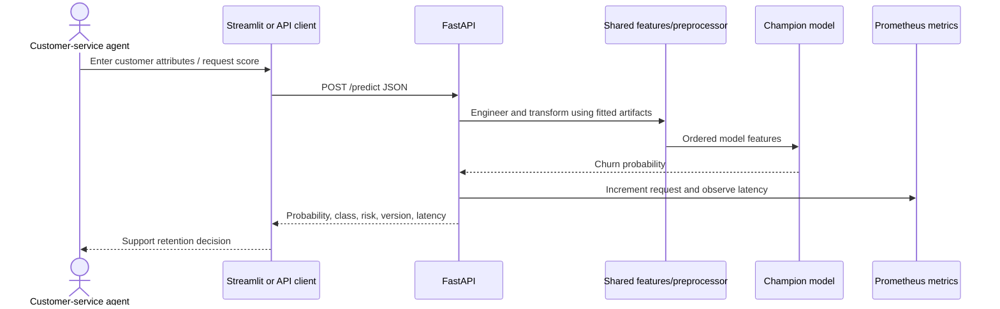
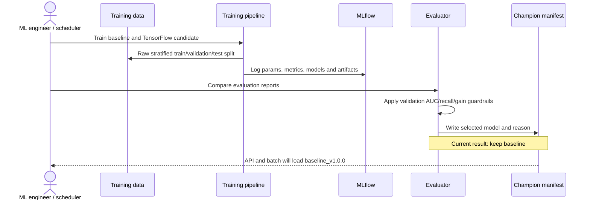

# Assignment Alignment, Verification, and End-to-End Workflow

**Project:** Enterprise MLOps Churn Prediction
**Review date:** 08 August 2026
**Authoritative requirement sources:** `GradedAssignment/Instructions.txt`, `GradedAssignment/Criteria.png`, and `GradedAssignment/Notes.txt`
**Path clarification:** `GradedAssignment/data-science-ml-labs/@notes.txt` does not exist. The available `GradedAssignment/Notes.txt` contains the additional checklist and a text version of the same five-part rubric shown in `Criteria.png`.

## 1. Executive conclusion

The core assignment is implemented and supported by retained execution evidence. The repository contains a repeatable TensorFlow-capable training pipeline, a simpler baseline, validation-based model promotion, online and batch inference, data-quality and drift checks, retraining decision logic, tests, configuration, a six-page PDF, an architecture image, and four demo-evidence panels.

The major distinction is between **core rubric completion** and **optional/prototype operational extensions**:

- Core rubric paths have been executed or directly verified: model training, evaluation, champion selection, API inference, batch scoring, benchmarking, drift detection, retraining-trigger scenarios, and unit tests.
- MLflow's tracking backend and two finished runs are verified; its browser UI is available when the local UI command is started.
- The Docker API plus Prometheus/Grafana path is locally verified with retained evidence. Streamlit, `/explain`, the MLflow Compose service, external alert delivery, and cloud deployment remain outside that verification boundary. The repository-root CI workflow is locally validated, but a hosted GitHub Actions run is not yet retained.
- The retraining component decides and logs whether retraining is needed. It does not invoke training automatically and is not connected to a scheduler. This still meets the assignment, which explicitly permits pseudocode or a short unwired function.

## 2. Rubric cross-verification: what was asked and what is complete

| Rubric criterion | What was asked | Evidence completed | Status / remaining improvement |
|---|---|---|---|
| 1. Problem Understanding & Data (4) | Use case, target, inputs, dataset, intended use, sound train/validation/test split | Binary telco churn use case; 7,043 rows and 21 raw columns; target `Churn`; intended real-time agent and monthly campaign use cases; stratified raw 60/20/20 split before fitting learned transformations; customer ID excluded from modeling | **Core complete.** A chronological split is not possible because this public snapshot has no event timestamp. State this explicitly rather than implying date boundaries exist. |
| 2. Model Development & Correctness (4) | Appropriate preprocessing/model choice, correct implementation, metrics suited to problem | Shared cleaning/encoding/scaling; baseline balanced Logistic Regression; **TensorFlow** candidate `[64,32,16]` with dropout, early stopping, LR reduction, deterministic seeds, and balanced class weights; AUC, recall, precision, F1, accuracy and confusion matrix; validation selects the champion and test is kept as final evidence | **Core complete.** Candidate remains TensorFlow 2.13; it was not replaced by `sklearn` MLP. A future enhancement is one-hot encoding for nominal categories and a documented small tuning search. |
| 3. Production System Design & Implementation (4) | Clear end-to-end inference workflow via API, batch, or app; Docker not required | FastAPI `/predict`, `/health`, `/metrics`, optional `/explain`; batch scorer; champion manifest used by both paths; shared artifacts; clean-built Docker API and retained monitoring verification | **Core complete.** Local container path verified; Streamlit, cloud deployment, and the MLflow Compose service remain outside the evidence boundary. |
| 4. Evaluation & Production Considerations (4) | Suitable metrics, imbalance handling, plus latency/throughput/monitoring/reliability | Balanced training, promotion guardrails, benchmark, batch throughput, verified Prometheus/Grafana wiring, JSON quality/drift checks, retraining signals, incident response and rollback | **Core complete.** External notifications and delayed-label model/business KPI automation remain future hardening. |
| 5. Documentation & Presentation (4) | Clear report covering approach, architecture, implementation, results, decisions, and repository link | Six-page, 1,523-word consolidated PDF; clickable repository link; architecture image; four evidence panels; README, quick start, design document and this audit | **Complete, with minor cleanup advised.** Keep optional hosted-CI and cloud-deployment claims qualified until retained execution evidence exists. |

This is an evidence-based readiness assessment, not a prediction of the instructor's exact mark.

## 3. Detailed Instructions.txt alignment

### A. Data and Features — 25%

| Requirement | Completion and evidence |
|---|---|
| Describe source, target, assumptions and cleaning | Completed in the PDF/design document and implemented in `src/data/quality.py` and `src/data/preprocessing.py`. `TotalCharges` is converted to numeric; its empty historical entries are handled; schema, missingness, ranges, duplicates and consistency are checked. |
| At least five non-trivial features | Six: `avg_monthly_charge`, `service_adoption_score`, `tenure_category`, `payment_risk_flag`, `contract_stability_score`, and `high_value_customer`. |
| Offline versus online features | All six are documented for both modes in `config/feature_config.yaml`. The data-derived high-value threshold is fitted only on training rows and persisted as `artifacts/feature_threshold.json` (`89.75`). |
| Prevent training-serving skew | Training, API and batch paths all call `FeatureEngineer` and `DataPreprocessor`; the serving paths load the fitted threshold and preprocessor instead of refitting them. |
| Batch/micro-batch ingestion with merge/dedup/logging | Implemented in `src/data/ingestion.py`, covered by unit tests, and executed end to end. `artifacts/logs/ingestion_20260808_082509.json` retains a successful 7,043-row reproducibility replay with its embedded quality report. |
| Data quality | Executed report passed overall: zero missing rate, zero duplicates, valid ranges. Fifty-nine historical `TotalCharges` deviations are retained as a non-blocking warning. |

### B. Model Training and Offline Evaluation — 25%

| Requirement | Completion and evidence |
|---|---|
| Repeatable load → split → feature → preprocess → train → evaluate → save pipeline | Implemented by `src/training/train.py` and tracked in MLflow. The split occurs before fitting the percentile threshold, encoders or scaler, avoiding leakage. |
| At least two versions | Baseline balanced Logistic Regression and TensorFlow neural-network candidate. |
| Metrics and rationale | AUC is the primary discrimination metric; recall is emphasized because missed churners are costlier; precision and F1 expose retention-budget trade-offs. |
| Promotion decision | Candidate passes absolute AUC/recall thresholds but loses `0.0054` validation AUC versus baseline. Decision: **keep baseline**. `models/current_best.json` records the result. |
| Save models and evaluation artifacts | Baseline `.pkl`, TensorFlow `.h5` plus metadata, JSON/Markdown evaluations, preprocessor, threshold, MLflow database and run artifacts are present. |

Measured results:

| Dataset / metric | Baseline | TensorFlow candidate |
|---|---:|---:|
| Validation AUC | 0.8354 | 0.8300 |
| Validation recall | 0.7941 | 0.7674 |
| Validation precision | 0.5174 | 0.5009 |
| Validation F1 | 0.6266 | 0.6061 |
| Final test AUC | 0.8429 | 0.8364 |
| Final test recall | 0.7807 | 0.7914 |

### C. Serving and Inference Pattern — 25%

| Requirement | Completion and evidence |
|---|---|
| Minimal prediction API and model version | `/predict` accepts the full customer payload and returns probability, Yes/No class, risk band, `baseline_v1.0.0`, latency and timestamp. |
| Explain the inference pattern | Hybrid design: synchronous online API for an agent waiting during a customer interaction, and offline chunked batch scoring for campaign lists. |
| Latency/throughput measurement | Saved benchmark contains 100 successful sequential and 100 successful concurrent requests. Sequential average `9.56 ms`, p95 `10.21 ms`, p99 `18.79 ms`; concurrent p95 `89.01 ms`, throughput `126.29 requests/sec`, success rate `100%`. |
| Batch evidence | All 7,043 rows were scored to `artifacts/predictions/batch_predictions.csv` in approximately `0.25 s`, roughly `27,730 rows/sec` on the local run. |
| Optional containerization | Dockerfile and Compose configuration exist, but the deployment is not claimed as verified. |

### D. Monitoring, Quality and Retraining — 25%

| Requirement | Completion and evidence |
|---|---|
| Infrastructure metrics | FastAPI exports request count, prediction errors and latency histogram at `/metrics`; alert rules describe API-down, error-rate, p95 latency and low-throughput conditions. |
| Data/feature metrics | Quality checker covers counts, missingness, ranges, duplicates and consistency. Drift detector applies PSI and KS to continuous features and chi-squared tests to categorical features. |
| Model/business metrics | AUC/recall monitoring and campaign KPIs are documented. **Not automated:** no delayed-label feedback pipeline currently computes live AUC or business ROI. |
| One working drift/quality check | Both are implemented and executed. Drift evidence: 5,000 baseline rows, 2,043 current rows, six checked features, zero detected drift in the simulated split. |
| Two or three retraining signals | Four implemented signals: new labeled-data volume, AUC degradation, drift score and days since training. Three triggering and one non-triggering scenario were executed and logged. |
| Incident scenario | Upstream `TotalCharges` schema/format failure, detection, quarantine/rollback, owner response and post-mortem are documented. |

## 4. Additional Notes.txt checklist

| Notes checklist item | Alignment |
|---|---|
| Row count, missing values, duplicates, wrong column types, dropped columns | Completed in the original notebook and quality/preprocessing modules. Row count is 7,043; `TotalCharges` type issue is handled; `customerID` is dropped from model features. |
| Correlation matrix | Present in `notebooks/00_original_notebook.ipynb`. |
| Univariate, bivariate and multivariate EDA | Present extensively in the original notebook, including categorical distributions, churn comparisons, numerical pair relationships and multivariate plots. The notebook retains outputs in 94 code cells, although execution counters are cleared. |
| One-hot/label encoding | The original EDA notebook demonstrates encoding. The production pipeline currently uses fitted integer mappings for categorical inputs and label encoding for the target. One-hot encoding of nominal production features remains an acknowledged improvement. |
| Standardization | Implemented with a scaler fitted only to training data and reused for validation, test and serving. |
| Target/features and feature evaluation | Completed through six production features, feature configuration and the original notebook's chi-square/importance analysis. |
| Training/evaluation split | Completed as stratified 60/20/20 train/validation/test. |
| Chronological split and date boundaries | Not applicable to the available static dataset because it has no event timestamp. The chosen stratified split should be explicitly justified in the report. |
| Log proofs | Quality, ingestion, retraining, MLflow, evaluation, benchmark, drift, API and batch evidence exists. The retained ingestion record is explicitly a reproducibility replay of the authoritative static dataset. |

## 5. Execution and verification record

### Fresh verification on 08 August 2026

The existing project-local environment was reused; no replacement ML framework was installed.

```bash
./venv/bin/python -c "import tensorflow, keras, sklearn, mlflow, fastapi"
./venv/bin/python -m pytest tests/unit -q --cov=src --cov-report=term --cov-report=xml
```

Verified versions: Python `3.9.6`, TensorFlow `2.13.0`, Keras `2.13.1`, scikit-learn `1.3.0`, MLflow `2.7.1`, FastAPI `0.103.1`. Test result: **100/100 unit and 4/4 integration passed**, source coverage **69%**.

The API was also verified in process with FastAPI's `TestClient`, including application startup and artifact loading:

```text
GET /health  -> 200, model_loaded=true, baseline_v1.0.0
POST /predict -> 200, probability=0.760917, class=Yes, risk=High
GET /metrics -> 200, Prometheus counters and latency histogram present
```

The MLflow SQLite backend was queried directly and contains experiment `churn-prediction` with two finished runs:

```text
baseline_20260808_041203  FINISHED
candidate_20260808_041229 FINISHED
```

### Commands that produced the retained workflow evidence

Run from the project root after `source venv/bin/activate`, or prefix commands with `./venv/bin/python`:

```bash
python -m src.data.quality

python -m src.training.train --model baseline
python -m src.training.train --model candidate
python -m src.training.evaluate

uvicorn src.serving.api:app --host 127.0.0.1 --port 8000
python scripts/benchmark_latency.py \
  --url http://127.0.0.1:8000 \
  --requests 100 \
  --concurrency 10 \
  --output artifacts/benchmark_results.json

python -m src.serving.batch_predict \
  --input data/raw/telco_customer_churn.csv \
  --output artifacts/predictions/batch_predictions.csv \
  --chunk-size 1000

python -m src.monitoring.drift_detector
python -m src.retraining.trigger
python -m pytest tests/unit -q --cov=src --cov-report=term --cov-report=xml

python scripts/build_submission_pdf.py
```

`src.training.evaluate` intentionally exits non-zero when the candidate is not promoted. In this run that is a correct guardrail decision, not a model-training failure.

### Local URLs and their verification status

| Component | Start command | URL | Status |
|---|---|---|---|
| FastAPI | `uvicorn src.serving.api:app --host 127.0.0.1 --port 8000` | `http://127.0.0.1:8000` | Executed previously for the saved benchmark; endpoints freshly verified in process |
| API docs | same as API | `http://127.0.0.1:8000/docs` | Generated automatically when API runs |
| Health | same as API | `http://127.0.0.1:8000/health` | Verified |
| Prediction | same as API | `POST http://127.0.0.1:8000/predict` | Verified |
| Prometheus-format API metrics | same as API | `http://127.0.0.1:8000/metrics` | Verified |
| MLflow UI | `mlflow ui --backend-store-uri sqlite:///mlflow.db --host 127.0.0.1 --port 5000` | `http://127.0.0.1:5000` | Backend and runs verified; start UI to browse them |
| Streamlit | `streamlit run webapp/app.py --server.address 127.0.0.1 --server.port 8501` | `http://127.0.0.1:8501` | Code/config only; not retained as verified execution |
| Prometheus UI | Compose with mounted config/rules | `http://127.0.0.1:9090` | Locally verified: ready, API target up, metric scraped, four rules loaded |
| Grafana | Compose with file provisioning | `http://127.0.0.1:3000` | Locally verified: healthy database, datasource and dashboard provisioned |

## 6. Online and offline triggers

| Mode | Trigger | What happens now | Automation boundary |
|---|---|---|---|
| Online inference | A user/system sends `POST /predict` | Validate payload → shared online features → fitted preprocessing → champion prediction → risk band/version/latency → Prometheus metrics | Synchronous and implemented |
| Interactive UI | Business user clicks Predict in Streamlit | UI forwards request to FastAPI | Implemented as prototype; UI launch not verified |
| Offline batch scoring | Operator/scheduler invokes `python -m src.serving.batch_predict ...` | Load champion once → transform all rows → score in chunks → write campaign CSV | CLI implemented and executed; external scheduling not included |
| Offline ingestion | New CRM CSV invokes `python -m src.data.ingestion --input ... --output ...` | Validate → merge → deduplicate by `customerID` → write table and JSON log | CLI and tests implemented; representative end-to-end replay executed and retained |
| Offline monitoring | Operator/scheduler invokes `python -m src.monitoring.drift_detector` | Compare baseline/current distributions → write JSON drift report | Implemented and executed on a simulated split |
| Retraining decision | Operator/scheduler invokes `python -m src.retraining.trigger` | Evaluate new-label count, AUC drop, drift and elapsed days → write decision log | Implemented and executed; does **not** start training |
| Actual retraining | Human/CI invokes baseline/candidate training and evaluation commands | Produce MLflow runs/artifacts → apply validation guardrails → update champion manifest | Manual orchestration; cron value is configuration only |

## 7. Implementation file responsibilities and interactions

### Runtime source files

| File | Role | Main interactions |
|---|---|---|
| `src/data/ingestion.py` | Reads incoming CSV, validates, merges, deduplicates and logs ingestion | Calls `DataQualityChecker`; produces the training table/log |
| `src/data/quality.py` | Schema, missingness, ranges, duplicates and consistency checks | Used standalone and by ingestion; emits JSON evidence |
| `src/data/preprocessing.py` | Cleaning, fitted categorical mappings, scaling, raw stratified split and serving transformation | Called by training, API and batch scorer; persists `preprocessor.pkl` |
| `src/features/engineering.py` | Creates six shared business features and persists the train-only percentile threshold | Called by training in offline mode and serving/batch in online mode |
| `src/models/baseline.py` | Balanced Logistic Regression build/train/evaluate/persist/predict | Instantiated by training; artifact loaded by serving when champion |
| `src/models/candidate.py` | TensorFlow neural network build/train/evaluate/persist/predict | Instantiated by training; `.h5` loaded if promotion selects candidate |
| `src/models/explainer.py` | Optional SHAP/LIME explanation adapter | Loaded opportunistically by FastAPI for `/explain` |
| `src/training/train.py` | End-to-end training pipeline and MLflow logging | Coordinates split, feature engineering, preprocessing and either model |
| `src/training/evaluate.py` | Baseline/candidate comparison and promotion guardrails | Reads evaluation JSON; writes comparison reports and `current_best.json` |
| `src/serving/api.py` | FastAPI online service, schema validation, champion loading and Prometheus instrumentation | Loads feature/preprocessing artifacts and model named by champion manifest |
| `src/serving/batch_predict.py` | Chunked offline scoring and campaign CSV generation | Uses the exact same feature/preprocessor/champion artifacts as API |
| `src/monitoring/drift_detector.py` | PSI, KS and chi-squared drift detection | Produces drift JSON used conceptually by retraining trigger |
| `src/retraining/trigger.py` | Evaluates four retraining eligibility signals and logs decisions | Consumes supplied monitoring/performance values; currently not wired to trainer |

### Supporting files

| File/group | Role |
|---|---|
| `config/config.yaml` | Paths, split seed, model hyperparameters, guardrails, serving thresholds, monitoring thresholds, MLflow URI and retraining policy |
| `config/feature_config.yaml` | Feature definitions, offline/online availability, skew risks, dropped/categorical/numerical columns |
| `scripts/benchmark_latency.py` | Sequential/concurrent API load generator and JSON performance report |
| `scripts/build_submission_pdf.py` | Builds the six-page consolidated assignment PDF from retained evidence |
| `webapp/app.py` | Optional Streamlit client for single prediction, batch exploration and monitoring views |
| `docker/Dockerfile.api`, `docker/docker-compose.yml` | Clean-built API and health-gated API/Prometheus/Grafana monitoring path; MLflow service separately configured |
| `monitoring/prometheus.yml`, `monitoring/alerts.yml` | Scrape and alert-rule definitions |
| `monitoring/grafana/dashboards/model_performance.json` | Optional dashboard definition |
| `tests/unit/*.py` | 96 tests across data, features, models, evaluation, serving, drift, explanation and retraining |
| `../../.github/workflows/enterprise-mlops-churn-ci.yml` | Discoverable repository-root CI workflow with data quality, 100 unit tests, TensorFlow training, governed selection, four saved-artifact integration tests, Docker smoke test, and release summary; hosted run pending |

### Generated evidence and deployable artifacts

| Artifact | Purpose |
|---|---|
| `artifacts/feature_threshold.json` | Train-only high-value threshold reused online |
| `artifacts/preprocessor.pkl` | Fitted transformations and feature ordering |
| `models/baseline/logistic_regression_v1.pkl` | Current champion model |
| `models/candidate/neural_network_v1.h5` | TensorFlow candidate |
| `models/current_best.json` | Single source of truth used by API and batch loaders |
| `artifacts/eval/*` | Baseline/candidate metrics, comparison and promotion evidence |
| `mlflow.db`, `mlruns/*` | Experiment metadata and two finished model runs |
| `artifacts/api_response.json` | Saved successful API request/response evidence |
| `artifacts/benchmark_results.json` | Sequential and concurrent latency/throughput evidence |
| `artifacts/predictions/batch_predictions.csv` | 7,043-row offline scoring output |
| `artifacts/drift_reports/drift_report_test.json` | Executed six-feature drift report |
| `artifacts/logs/*` | Quality and four retraining-scenario reports |
| `coverage.xml`, `artifacts/test_summary.json` | Test and coverage evidence |
| `output/pdf/enterprise_mlops_churn_submission.pdf` | Six-page, 1,523-word submission with repository hyperlink |

## 8. End-to-end project workflow

```mermaid
flowchart LR
    subgraph Users[Users and external systems]
        CRM[CRM / daily customer CSV]
        Agent[Customer-service agent]
        Marketing[Marketing analyst]
        Operator[ML engineer / scheduler]
        Labels[Delayed churn labels and campaign outcomes]
    end

    subgraph Data[Data and feature layer]
        Ingest[Batch ingestion\nvalidate · merge · deduplicate · log]
        Quality[Data-quality gate\nschema · nulls · ranges · duplicates]
        Store[(Raw / training CSV)]
        FE[Shared FeatureEngineer\n6 offline/online features]
        Prep[Fitted DataPreprocessor\nclean · encode · scale · order]
        FEArtifacts[(feature_threshold.json\npreprocessor.pkl)]
    end

    subgraph Train[Offline training and governance]
        Split[Raw stratified 60/20/20 split\nfit only on train]
        Base[Balanced Logistic Regression]
        TF[TensorFlow candidate\n64 · 32 · 16 + dropout]
        MLflow[(MLflow SQLite + artifacts)]
        Compare[Validation comparison\nAUC / recall guardrails]
        Champion[(current_best.json\nBaseline selected)]
        Test[Untouched test-set report]
    end

    subgraph Serve[Inference]
        API[FastAPI\n/predict · /health · /metrics]
        UI[Optional Streamlit client]
        Batch[Chunked batch scorer]
        Response[Probability · class · risk\nversion · latency]
        Campaign[(Campaign predictions CSV)]
    end

    subgraph Observe[Observability and lifecycle]
        Metrics[Prometheus-format metrics\ncount · errors · latency]
        PG[Prometheus / Grafana locally verified]
        Drift[Offline drift check\nPSI · KS · chi-squared]
        Feedback[Delayed-label AUC and business KPI\nplanned automation]
        Trigger{Retraining trigger\nlabels · AUC drop · drift · age}
        Alert[Engineer / data-scientist alert\nand incident response]
        NoAction[Log decision and continue monitoring]
    end

    CRM --> Ingest --> Quality
    Quality -- pass --> Store
    Quality -- fail --> Alert
    Store --> Split --> FE --> Prep
    FE --> FEArtifacts
    Prep --> FEArtifacts
    Prep --> Base
    Prep --> TF
    Base --> MLflow
    TF --> MLflow
    Base --> Compare
    TF --> Compare
    Compare --> Champion
    Compare --> Test

    Agent --> API
    Marketing --> UI --> API
    Operator --> Batch
    Store --> Batch
    FEArtifacts --> API
    FEArtifacts --> Batch
    Champion --> API
    Champion --> Batch
    API --> Response --> Agent
    API --> Metrics --> PG --> Alert
    Batch --> Campaign --> Marketing

    Store --> Drift --> Trigger
    Labels --> Feedback --> Trigger
    Metrics --> Trigger
    Trigger -- "eligible: human or CI starts run" --> Split
    Trigger -- "no signal" --> NoAction
    Trigger --> Alert
```



## 9. User/system interaction sequences

### Online prediction



### Offline learning and promotion



## 10. Necessary improvements, ordered by value

1. **Enable external notification delivery only if required.** Add Alertmanager plus a governed email/webhook destination and secret handling; local Prometheus rule evaluation is already verified.
2. **Fix Compose/README consistency.** The Compose file has no Streamlit service; the verified container boundary is API/Prometheus/Grafana, while MLflow remains separately configured.
3. **Retain hosted CI evidence.** Run the implemented repository-root workflow on GitHub-hosted infrastructure and retain its successful run URL.
4. **Automate delayed-label evaluation.** Join predictions to later outcomes, calculate windowed AUC/recall and campaign ROI, and feed the results into the retraining trigger.
5. **Wire scheduling only if bonus production hardening is desired.** The configured weekly cron is not an active scheduler. Add an orchestrator job that runs quality → drift → trigger → training/evaluation only after approval.
6. **Improve nominal encoding.** Replace arbitrary integer mappings for nominal categories with a fitted one-hot encoder or an explicit production-safe alternative, preserving unknown-category behavior.
7. **Qualify optional claims.** Treat SHAP/LIME, Streamlit, hosted CI, external alert delivery, and cloud deployment as unverified until each has retained evidence.

None of items 2–8 is required to demonstrate the core assignment's minimum functioning mini-production system; they improve evidence quality, bonus readiness and operational credibility.
